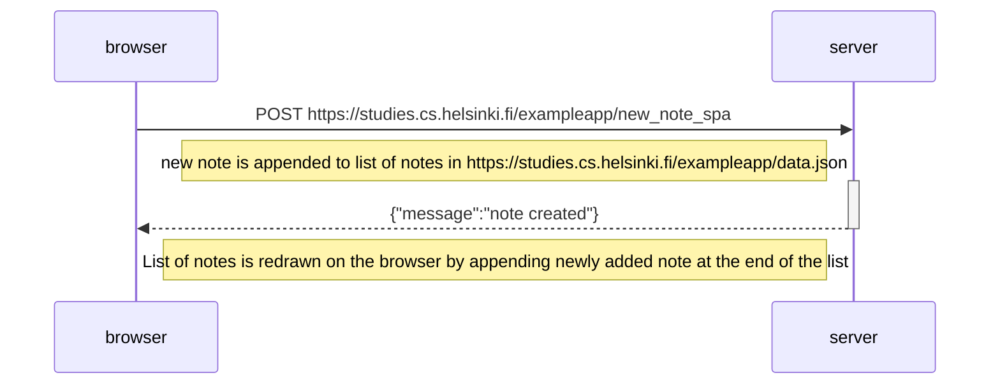

```mermaid
  sequenceDiagram
      participant browser
      participant server

      browser->>server: POST https://studies.cs.helsinki.fi/exampleapp/new_note_spa
      Note left of server: new note is appended to list of notes in https://studies.cs.helsinki.fi/exampleapp/data.json
      activate server
      server-->>browser: {"message":"note created"}
      deactivate server


      Note right of browser: List of notes is redrawn on the browser by appending newly added note at the end of the list
```